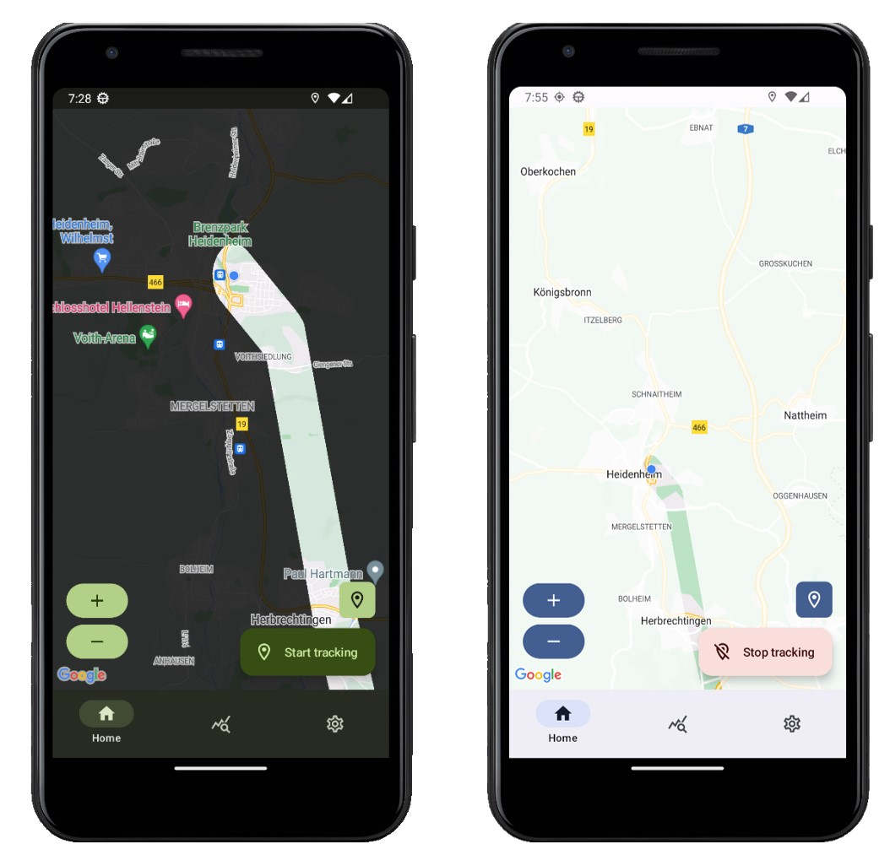
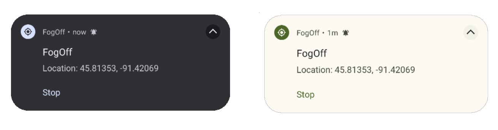
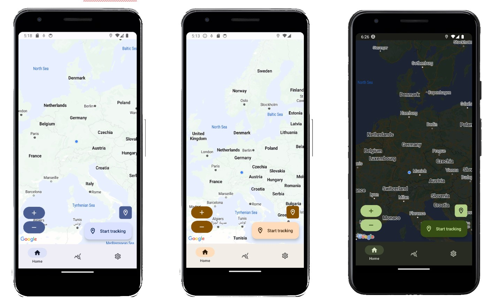
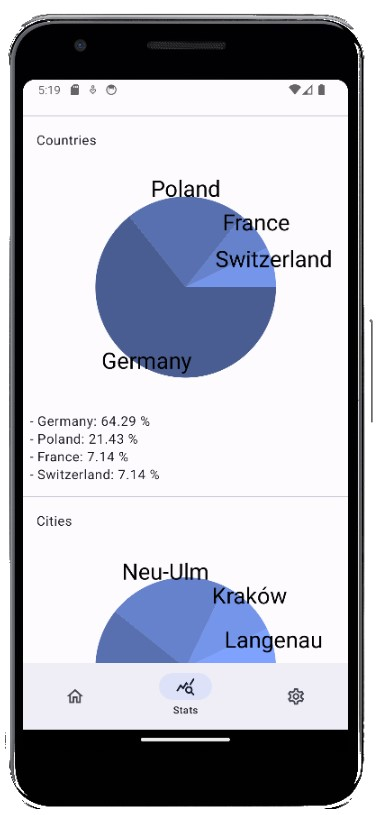
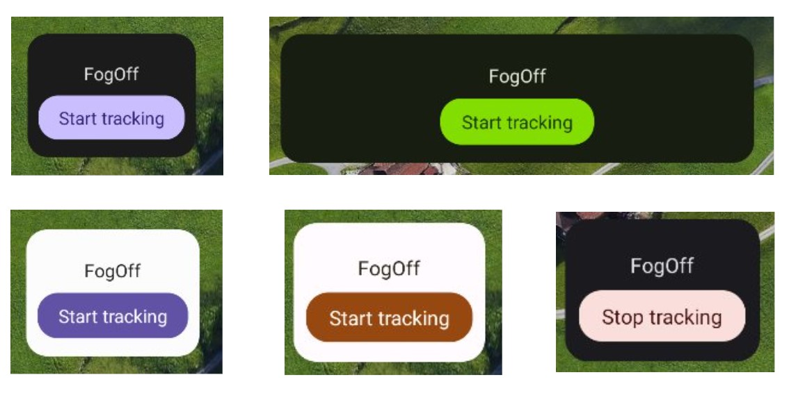

# FogOff

FogOff is a revolutionary GPS-based app that brings the concept of Fog of War to real-life exploration. This innovative app overlays a fog-like layer on your GPS map, revealing your surroundings as you move through them. Imagine turning your daily commute, hike, or road trip into a thrilling adventure game.

## How to use

- Add your own Google Maps API key (in the AndroidManifest.xml)
- Compile the app

# Features

## Map

Uncover the world map in a user adjustable radius (change it on the settings page)

## Widget

Get notified about being tracked by the app:

## Dynamic color theme

Color theme changes according to the system wide theme:

## World exploration stats

Get stats about which cities and countries you explored:

## Widget

Use the widget to start and stop the gps tracking on your home screen:

## GPX Import

Import your already tracked walks from any GPX file on the settings page

